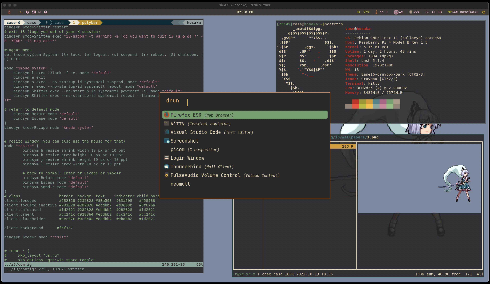

# Portable deka 



## Details about my setup:
- **Hardware**                     : Raspberry pi 4B 8GB
- **OS**                           : Rpi OS
- **WM**                           : i3
- **Shell**                        : Bash
- **Terminal**                     : Kitty
- **Notify Daemon**                : dunst
- **Bar**                          : polybar
- **Launcher**                     : rofi
- **Mail**                         : neomutt
- **Video**                        : mpv
- **Music**                        : spt, cmus
- **File Manager**                 : ranger
- **Compositor**                   : picom
- **Editor**                       : nvim, vim

## System Requirements
 - Raspberry Pi OS light
## Installation and initial setup

### Overclock Raspberry pi
```
over_voltage=6
arm_freq=2000
gpu_freq=650
```

`sh pkg-install.sh` - utiles and tools for system

### Portability tools
- [sshrc](https://github.com/cdown/sshrc)
- [PiKISS](https://github.com/jmcerrejon/PiKISS)
- [rpi-usb-gadget](https://github.com/kmpm/rpi-usb-gadget)
- [openvpn](https://github.com/kylemanna/docker-openvpn)
- [wireguard](https://github.com/jnnngs/wireguard.sh)

